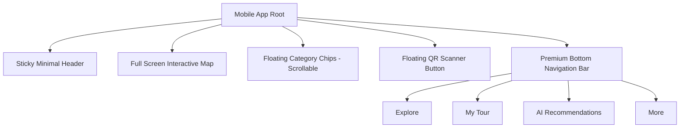

# 📱 [UX Draft] NoWiFi GPS Tours: 모바일 UI/UX 혁신 기획안

## 1. 🔍 현황 분석 및 문제점 (Current Issues)
- **메뉴 과부하**: 상단 헤더에 10개 이상의 버튼이 밀집되어 모바일에서 터치가 어렵고 시각적 피로도 높음.
- **엄지손가락 영역 미활용**: 모바일 기기의 하단(Thumb Zone)을 활용하지 않아 한 손 조작이 불편함.
- **계층 구조 부재**: 단순 필터(맛집, 명소)와 핵심 액션(출발/도착, 목록)이 동일한 수준으로 배치됨.

---

## 2. ✨ 모바일 UI 개편 전략 (4S Design)

### [Specialized] 모바일 전용 Bottom Navigation 도입
사용자가 가장 빈번하게 사용하는 기능을 하단 탭으로 이동시켜 **'한 손 조작'** 완성.
1. **Explore (탐색)**: 기본 지도 화면 & 명소 마커 표시
2. **My Tour (나의 투어)**: 현재 경로 및 출발/도착 지점 관리
3. **AI Guide (AI 추천)**: 사용자 맞춤 명소 실시간 추천
4. **My Page (내 정보)**: 여행 기록 및 설정

### [Simple] 헤더 간소화 (Minimal Header)
상단은 정보의 '상태'와 '빠른 도구' 위주로 재구성.
- 좌측: 현재 도시 선택 (City Selector)
- 중앙: 로고
- 우측: 다국어 선택 (Language) & QR 스캔(FAB 연동 가능)

### [Smart] 컨텍스트 칩 (Contextual Chips)
'맛집', '액티비티', '명소' 등 카테고리 필터는 지도의 특정 영역에 가로 스크롤이 가능한 **플로팅 칩(Floating Chips)** 형태로 배치하여 화면 공간 확보.

### [Speed] 글래스모피즘(Glassmorphism) 프리미엄 룩
- 배경이 은은하게 비치는 블러(Blur) 처리된 다크/화이트 모드로 고급스러운 브랜드 이미지 구축.
- 버튼 클릭 시 미세한 진동(Haptic)과 부드러운 트랜지션 적용.

---

## 3. 🖼️ 예상 컴포넌트 구조 (Proposed Architecture)

---

## 🚀 추천 에이전트 & 프롬프트

**추천 에이전트**: `Designer Kim` (`./agent/skills/designer_kim`)

**수행 명령 프롬프트**:
> "위의 `20260221_Mobile_UX_Innovation_Draft.md` 기획안을 바탕으로 `MobileBottomNav.tsx`와 `MobileHeader.tsx` 컴포넌트를 새롭게 개발해줘. `shadcn/ui`와 `framer-motion`을 사용하여 프리미엄한 애니메이션 효과를 넣고, 기존 `UnifiedFloatingCard.tsx`와의 데이터 연동이 끊기지 않도록 설계해줘."
