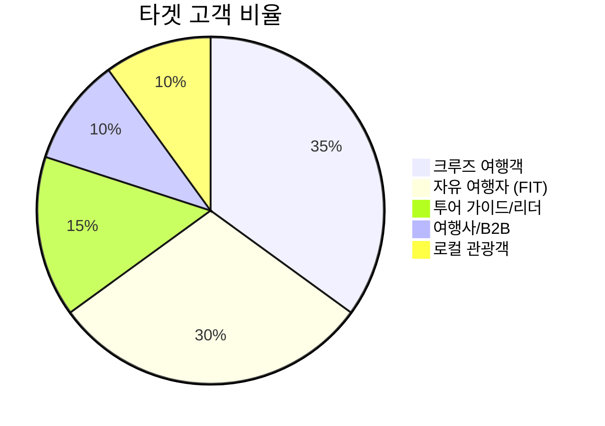
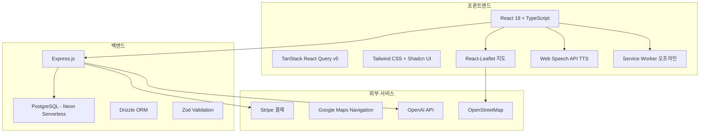
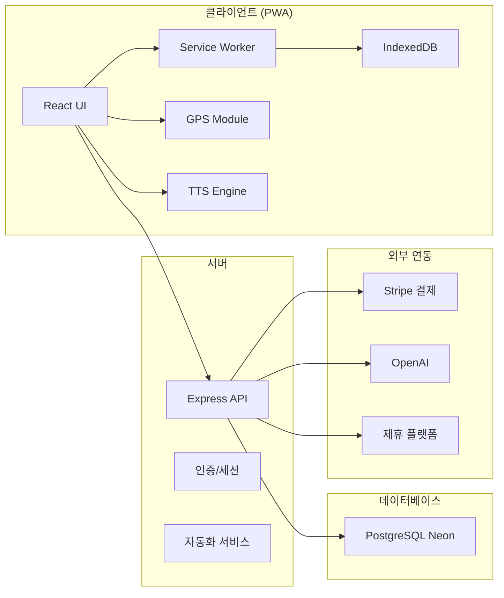
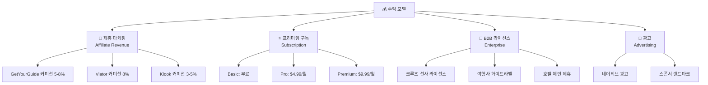
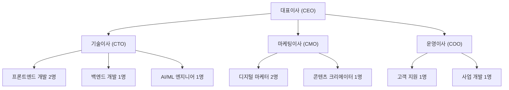

# 📋 GPS Audio Guide - 사업계획서 (Business Plan)

> **NoWiFi GPS Tours** — 와이파이 없이 세계를 여행하는 AI 오디오 가이드 플랫폼
> 
> 작성일: 2026년 2월 11일 | 버전: 1.0

---

## 1. 📌 Executive Summary (요약)

**NoWiFi GPS Tours**는 크루즈 여행객 및 글로벌 관광객을 위한 **오프라인 GPS 오디오 가이드 PWA(Progressive Web App)** 플랫폼입니다.

| 항목 | 내용 |
|------|------|
| **서비스명** | NoWiFi GPS Tours |
| **형태** | PWA 웹 애플리케이션 (설치형) |
| **핵심 가치** | 와이파이 없이도 작동하는 AI 기반 다국어 관광 오디오 가이드 |
| **타겟 시장** | 크루즈 여행객, 자유 여행자, 투어 가이드, 여행사 |
| **지원 도시** | 18개 글로벌 도시 (로마, 파리, 런던, 바르셀로나, 싱가포르 등) |
| **지원 언어** | 10개 언어 (영어, 한국어, 일본어, 중국어, 스페인어 등) |
| **수익 모델** | 제휴 마케팅(어필리에이트), 프리미엄 구독, B2B 라이선스 |

### 핵심 차별점
1. **완전 오프라인 작동** — 해외 로밍 비용 제로, 데이터 걱정 없음
2. **AI 기반 다국어 음성 가이드** — Web Speech API 활용, 10개 언어 실시간 TTS
3. **크루즈 특화 기능** — 기항지 관광 추천, 제한된 시간 내 최적 루트
4. **제로 다운로드 장벽** — 앱스토어 설치 불필요, 브라우저에서 즉시 사용

---

## 2. 🌍 시장 분석 (Market Analysis)

### 2.1 글로벌 여행 시장 규모

| 시장 구분 | 2025 규모 | 2030 전망 | CAGR |
|-----------|-----------|-----------|------|
| 글로벌 여행 시장 | $8.6조 | $15.5조 | 12.5% |
| 크루즈 산업 | $45B | $65B | 7.6% |
| 오디오 가이드 시장 | $1.2B | $3.5B | 23.8% |
| 여행 앱 시장 | $20B | $45B | 17.6% |

### 2.2 타겟 고객 세그먼트



#### 주요 고객 페르소나

| 페르소나 | 연령 | 특징 | Pain Point |
|----------|------|------|------------|
| 🚢 크루즈 여행자 Sarah | 45-65세 | 미국/유럽, 프리미엄 여행 선호 | 기항지에서 제한된 시간, 인터넷 없음 |
| 🎒 자유 여행자 Yuki | 25-35세 | 아시아, 가성비 여행 | 가이드 고용 비용 부담, 언어 장벽 |
| 🎤 투어 리더 Carlos | 30-50세 | 소규모 그룹 투어 운영 | 다국어 설명 준비 부담, 루트 계획 |
| 🏢 여행사 TravelCo | - | B2B 파트너 | 디지털 전환, 고객 경험 차별화 |

### 2.3 경쟁 분석

| 경쟁사 | 오프라인 | 다국어 | 크루즈 특화 | PWA | 가격 |
|--------|:--------:|:------:|:-----------:|:---:|------|
| **NoWiFi GPS Tours** | ✅ | ✅ 10개 | ✅ | ✅ | Freemium |
| Rick Steves Audio | ⚠️ 일부 | ❌ 영어만 | ❌ | ❌ | $14.99/도시 |
| izi.TRAVEL | ⚠️ 일부 | ✅ | ❌ | ❌ | 무료+광고 |
| Detour/Bose | ✅ | ⚠️ 3개 | ❌ | ❌ | $4.99/투어 |
| Google Maps Audio | ❌ | ✅ | ❌ | ❌ | 무료 |

> [!IMPORTANT]
> **경쟁 우위**: 오프라인 + 다국어 + 크루즈 특화 + PWA를 모두 갖춘 솔루션은 현재 시장에 없음

---

## 3. 🛠️ 제품 및 기술 (Product & Technology)

### 3.1 기술 스택



### 3.2 핵심 기능 매트릭스

| 기능 | 상태 | 설명 |
|------|:----:|------|
| 인터랙티브 GPS 지도 | ✅ 완료 | Leaflet 기반, 실시간 위치 추적 |
| AI 오디오 내레이션 | ✅ 완료 | 10개 언어 TTS, 속도 조절 |
| 턴바이턴 내비게이션 | ✅ 완료 | Leaflet Routing Machine |
| 오프라인 모드 | ✅ 완료 | Service Worker + IndexedDB |
| 크루즈 기항지 정보 | ✅ 완료 | 5개 크루즈 도시 |
| 투어 루트 계획 | ✅ 완료 | 순차적 루트 + 거리/시간 표시 |
| 티켓/투어 예약 연동 | ✅ 완료 | GetYourGuide, Viator, Klook |
| PWA 설치 | ✅ 완료 | 홈 화면 추가, 네이티브 경험 |
| 관리자 대시보드 | ✅ 완료 | 콘텐츠/사용자/분석 관리 |
| AI 마케팅 자동화 | 🔨 개발중 | 콘텐츠 자동 생성 및 배포 |
| Stripe 결제 시스템 | 🔨 개발중 | 프리미엄 구독 결제 |
| 제휴 수익 추적 | 🔨 개발중 | 어필리에이트 클릭/전환 추적 |

### 3.3 시스템 아키텍처



---

## 4. 💰 수익 모델 (Revenue Model)

### 4.1 수익 구조



### 4.2 가격 정책

| 플랜 | 가격 | 기능 |
|------|------|------|
| **Basic (무료)** | $0 | 3개 도시, 기본 오디오 가이드, 오프라인 1개 도시 |
| **Pro** | $4.99/월 | 모든 도시, 고급 AI 가이드, 무제한 오프라인 |
| **Premium** | $9.99/월 | Pro + 맞춤 투어, 우선 지원, 광고 제거 |
| **Enterprise** | 협의 | 화이트라벨, API 접근, 커스텀 브랜딩 |

### 4.3 제휴 마케팅 수익 예측

| 제휴 플랫폼 | 평균 주문 금액 | 커미션율 | 월간 전환 수 | 월 수익 |
|-------------|:-------------:|:--------:|:-----------:|--------:|
| GetYourGuide | $65 | 8% | 500 | $2,600 |
| Viator | $80 | 8% | 350 | $2,240 |
| Klook | $45 | 5% | 400 | $900 |
| **합계** | | | **1,250** | **$5,740** |

---

## 5. 📊 마케팅 전략 (Marketing Strategy)

### 5.1 마케팅 채널 전략

| 채널 | 전략 | KPI |
|------|------|-----|
| **SEO/콘텐츠** | "크루즈 기항지 가이드", "오프라인 여행 앱" 키워드 공략 | 월 50K 오가닉 방문 |
| **소셜 미디어** | 인스타그램 릴스, TikTok 여행 콘텐츠 | 팔로워 100K |
| **제휴 파트너십** | 크루즈 블로거, 여행 인플루언서 | 월 200건 제휴 전환 |
| **B2B 영업** | 크루즈 선사, 여행사 직접 영업 | 분기 5건 계약 |
| **ASO/PWA** | 앱 스토어 최적화, PWA 설치 유도 | 월 10K 설치 |

### 5.2 AI 마케팅 자동화 시스템

프로젝트에 내장된 **3대 마케팅 엔진**을 활용:

1. **🧠 콘텐츠 생성 엔진** — OpenAI API 연동, 다국어 홍보 콘텐츠 자동 생성
2. **🏃 다채널 배포 엔진** — SNS 자동 포스팅, 최적 시간대 스케줄링
3. **👀 분석/리타겟팅 엔진** — 클릭률/전환율 분석, A/B 테스트 자동화

### 5.3 성장 전략 로드맵

```mermaid
gantt
    title 마케팅 성장 로드맵
    dateFormat YYYY-Q
    axisFormat %Y-Q%q
    
    section Phase 1 - 런칭
    SEO 기반 구축           :2026-Q1, 90d
    크루즈 블로거 제휴       :2026-Q1, 90d
    
    section Phase 2 - 성장
    소셜 미디어 캠페인       :2026-Q2, 180d
    B2B 파트너십 확대        :2026-Q2, 180d
    인플루언서 마케팅        :2026-Q3, 90d
    
    section Phase 3 - 확장
    글로벌 PR               :2026-Q4, 90d
    크루즈 선사 제휴         :2026-Q4, 180d
```

---

## 6. 🏗️ 운영 계획 (Operations Plan)

### 6.1 조직 구성



### 6.2 개발 로드맵

| 단계 | 기간 | 목표 | 주요 작업 |
|------|------|------|-----------|
| **Phase 1** | 2026 Q1 | MVP 완성 | 결제 시스템, 제휴 추적, 사용자 인증 |
| **Phase 2** | 2026 Q2 | 시장 진입 | 10개 도시 추가, AI 가이드 고도화, 마케팅 런칭 |
| **Phase 3** | 2026 Q3-Q4 | 성장 가속 | B2B 플랫폼, 가이드 마켓플레이스, 30개 도시 |
| **Phase 4** | 2027 | 글로벌 확장 | 50개 도시, 크루즈 선사 통합, 시리즈 A |

---

## 7. 📈 재무 계획 (Financial Plan)

### 7.1 초기 투자 비용

| 항목 | 비용 (USD) |
|------|----------:|
| 개발 인건비 (6개월) | $180,000 |
| 클라우드 인프라 | $12,000 |
| 마케팅 초기 비용 | $30,000 |
| 법무/회계/행정 | $15,000 |
| 콘텐츠 제작 (번역/사진) | $20,000 |
| 예비비 (10%) | $25,700 |
| **합계** | **$282,700** |

### 7.2 매출 및 수익 전망 (3년)

| 연도 | 사용자 수 | 유료 전환율 | 구독 매출 | 제휴 매출 | B2B 매출 | 총 매출 | 비용 | 순이익 |
|------|----------:|:----------:|----------:|----------:|---------:|--------:|------:|-------:|
| **Y1** | 50K | 3% | $90K | $69K | $30K | **$189K** | $350K | -$161K |
| **Y2** | 250K | 5% | $750K | $345K | $200K | **$1.3M** | $800K | $500K |
| **Y3** | 1M | 7% | $4.2M | $1.4M | $800K | **$6.4M** | $2.5M | $3.9M |

### 7.3 손익분기점 (BEP)

```
BEP 도달 예상: Y1 Q4 ~ Y2 Q1 (서비스 런칭 후 12-15개월)
월간 손익분기 MAU: ~80,000 (유료 전환율 4% 기준)
```

### 7.4 주요 재무 지표

| 지표 | Y1 | Y2 | Y3 |
|------|:--:|:--:|:--:|
| MRR (월간 반복 매출) | $7.5K | $62.5K | $350K |
| ARPU (사용자당 매출) | $3.78 | $5.20 | $6.40 |
| CAC (고객 획득 비용) | $5.00 | $3.20 | $2.50 |
| LTV (고객 생애 가치) | $18.00 | $31.20 | $51.20 |
| LTV/CAC 비율 | 3.6x | 9.75x | 20.5x |

---

## 8. 🎯 핵심 성과 지표 (KPIs)

| KPI | Y1 목표 | Y2 목표 | Y3 목표 |
|-----|--------:|--------:|--------:|
| MAU (월간 활성 사용자) | 15K | 80K | 350K |
| 유료 구독자 수 | 1,500 | 12,500 | 70,000 |
| 제휴 전환 건수/월 | 500 | 2,500 | 10,000 |
| 오프라인 다운로드/월 | 5K | 30K | 120K |
| NPS (고객 추천 지수) | 40+ | 50+ | 60+ |
| 지원 도시 수 | 25 | 40 | 60 |

---

## 9. ⚠️ 리스크 및 대응 전략

| 리스크 | 영향도 | 발생 가능성 | 대응 전략 |
|--------|:------:|:----------:|-----------|
| 경쟁사 시장 진입 | 높음 | 중간 | 크루즈 특화 니치 강화, 빠른 도시 확장 |
| 기술적 장애 (오프라인 한계) | 중간 | 낮음 | 지속적 Service Worker 개선, 사전 캐싱 고도화 |
| 크루즈 산업 침체 | 높음 | 낮음 | FIT(개인 여행자) 시장으로 포트폴리오 다변화 |
| 제휴 플랫폼 정책 변경 | 중간 | 중간 | 다양한 제휴 파트너 확보, 자체 예약 시스템 개발 |
| 환율 변동 | 낮음 | 높음 | 다중 통화 지원, 현지화 가격 정책 |

---

## 10. 🏆 팀 소개

| 역할 | 핵심 역량 |
|------|-----------|
| **CEO/Founder** | 글로벌 여행 산업 전문가, 크루즈/관광 비즈니스 경력 |
| **CTO** | 풀스택 개발, PWA/오프라인 기술 전문 |
| **AI 어벤져스 팀** | AI 기반 마케팅, 자동화, 콘텐츠 생성 |

### AI 어벤져스 팀 구성

| 에이전트 | 역할 | 핵심 능력 |
|----------|------|-----------|
| 🎯 마케터 쏭 | AI 마케팅 전략가 | 카피라이팅, SEO, 그로스해킹, 브랜딩 |
| ⚙️ 산업공학박사 | 업무 자동화 전문 | 워크플로우 자동화, 프로세스 최적화 |
| 💰 회계부장 | 재무/정산 관리 | 수익 분석, 정산 시스템, 재무 리포팅 |
| 🐟 코다리부장 | 총괄 매니저 | 프로젝트 관리, 팀 조율, 의사결정 |

---

*이 사업계획서는 NoWiFi GPS Tours 프로젝트의 현재 개발 상태와 시장 분석을 기반으로 작성되었습니다.*
