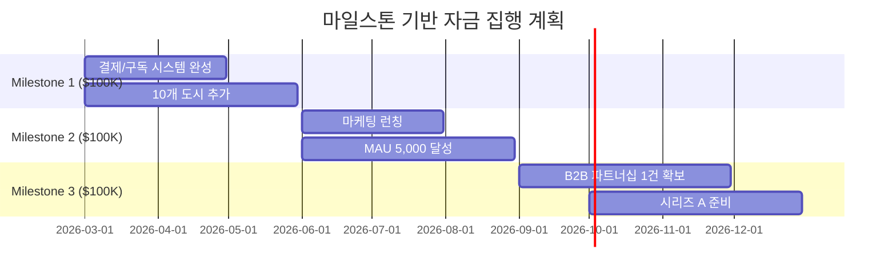

# 💎 투자 제안서 (Investment Proposal)

> **NoWiFi GPS Tours** — 글로벌 오프라인 AI 오디오 가이드 플랫폼
> 
> 🚢 크루즈 여행 시장의 디지털 동반자
> 
> 작성일: 2026년 2월 11일

---

## 1. 투자 개요

| 항목 | 내용 |
|------|------|
| **투자 라운드** | Pre-Seed / Seed |
| **목표 투자금** | **$300,000 ~ $500,000** |
| **밸류에이션 (Pre-money)** | $2,000,000 |
| **투자금 사용 기간** | 12~18개월 |
| **목표 Exit** | 시리즈 A (2027 Q4) 또는 전략적 M&A |

---

## 2. 왜 지금 투자해야 하는가?

### 🔥 시장 타이밍

1. **크루즈 산업 폭발적 성장** — 코로나 이후 크루즈 예약 역대 최고치, 2025년 3,580만 승객 돌파
2. **오프라인 여행 앱 공백** — 대부분의 여행 앱이 인터넷 의존, 오프라인 니치 시장 선점 기회
3. **AI 기술 성숙** — TTS, 번역, 콘텐츠 생성 AI의 비용 급감으로 자동화 가능
4. **PWA 기술 보편화** — 앱스토어 의존 없이 즉시 배포, 설치 가능

### 📊 핵심 투자 포인트

| 포인트 | 설명 |
|--------|------|
| **🎯 명확한 Pain Point** | 크루즈 기항지에서 제한된 시간 + 인터넷 없음 = 해결되지 않은 문제 |
| **🛡️ 기술적 해자 (Moat)** | 완전 오프라인 + 다국어 AI + 크루즈 특화 = 진입 장벽 |
| **💸 다중 수익원** | 제휴 + 구독 + B2B = 안정적 포트폴리오 |
| **📈 높은 확장성** | 도시 추가 비용 극소, 언어 추가 자동화 가능 |
| **🔄 낮은 CAC** | SEO/오가닉 + 제휴 파트너십으로 바이럴 성장 |

---

## 3. 제품 현황 (Traction)

### 이미 구축된 것

| 항목 | 현황 |
|------|------|
| **MVP 완성도** | 90% — 핵심 기능 모두 구현 |
| **지원 도시** | 18개 글로벌 도시 |
| **지원 언어** | 10개 언어 |
| **코드베이스** | 8,000+ 라인, 프로덕션 준비 상태 |
| **오프라인 기능** | Service Worker + IndexedDB 완전 구현 |
| **제휴 연동** | GetYourGuide, Viator, Klook 통합 완료 |
| **결제 인프라** | Stripe 결제 통합 진행 중 |
| **AI 자동화** | OpenAI 기반 마케팅 콘텐츠 자동 생성 |

### 기술적 우위

```
✅ 완전 오프라인 작동 (Service Worker + IndexedDB + 캐싱)
✅ 10개 언어 실시간 TTS (Web Speech API)
✅ PWA — 앱스토어 없이 즉시 설치
✅ 크루즈 기항지 최적 루트 (Leaflet Routing Machine)
✅ AI 마케팅 자동화 파이프라인
✅ 반응형 모바일 최적화 UI
```

---

## 4. 투자금 사용 계획

### 4.1 자금 배분

| 용도 | 금액 ($300K 기준) | 비율 | 세부 내용 |
|------|------------------:|:----:|-----------|
| **제품 개발** | $120,000 | 40% | 결제 시스템 완성, 도시 확장, AI 고도화 |
| **마케팅/성장** | $75,000 | 25% | SEO, 인플루언서, 크루즈 커뮤니티 |
| **인력 채용** | $60,000 | 20% | 프론트엔드 1명, 마케터 1명 |
| **인프라/운영** | $30,000 | 10% | 클라우드, API, 법무 |
| **예비비** | $15,000 | 5% | 비상 자금 |

### 4.2 마일스톤 기반 자금 집행



---

## 5. 재무 전망

### 5.1 주요 재무 지표

| 지표 | Y1 | Y2 | Y3 |
|------|---:|---:|---:|
| **총 매출** | $189K | $1.3M | $6.4M |
| **총 비용** | $350K | $800K | $2.5M |
| **순이익** | -$161K | $500K | $3.9M |
| **영업이익률** | -85% | 38% | 61% |
| **MAU** | 15K | 80K | 350K |
| **유료 구독자** | 1,500 | 12,500 | 70,000 |

### 5.2 투자 수익률 (ROI)

| 시나리오 | Y3 밸류에이션 | 투자 수익률 |
|----------|-------------:|------------:|
| **보수적** | $15M | 7.5x |
| **기본** | $30M | 15x |
| **낙관적** | $60M | 30x |

### 5.3 Exit 전략

| Exit 경로 | 시점 | 예상 밸류에이션 | 가능성 |
|-----------|------|---------------:|:------:|
| 시리즈 A | 2027 Q4 | $15~30M | 높음 |
| 전략적 M&A (여행 플랫폼) | 2028 | $30~60M | 중간 |
| 크루즈 선사 인수 | 2028-2029 | $50~100M | 낮음 |

> [!TIP]
> **잠재적 인수자**: Booking Holdings, TripAdvisor, Royal Caribbean, Carnival Corp, GetYourGuide

---

## 6. 경쟁 우위 분석

### 6.1 독보적 포지셔닝

```
                    오프라인 기능
                         ↑
                         |
          NoWiFi GPS ★   |
          Tours          |
                         |
    ─────────────────────┼──────────────────→ 다국어 지원
                         |
           izi.TRAVEL    |     Google Maps
                         |
                         |
          Rick Steves    |     Detour
                         |
```

### 6.2 참입 장벽 (Moat)

1. **기술적 해자** — 완전 오프라인 PWA + 실시간 TTS 통합은 구현 난이도 높음
2. **데이터 해자** — 18개 도시 × 10개 언어 = 180개 콘텐츠 세트 축적
3. **네트워크 효과** — 사용자 리뷰/경로 공유 → 콘텐츠 자연 성장
4. **파트너십 해자** — 제휴 플랫폼/크루즈 선사와의 초기 관계 구축

---

## 7. 팀

| 멤버 | 역할 | 강점 |
|------|------|------|
| **대표이사** | CEO & Founder | 글로벌 여행/크루즈 산업 전문, 사업 개발 |
| **AI 어벤져스** | 기술 + 마케팅 | AI 기반 자동화된 개발/마케팅/운영 팀 |

### AI 어벤져스 — 인간 1인 + AI 팀의 초효율 운영

> 전통적 스타트업 대비 **인건비 70% 절감** 가능한 AI 네이티브 운영 모델

| AI 에이전트 | 담당 | 효과 |
|-------------|------|------|
| 🎯 마케터 쏭 | 마케팅 전략/콘텐츠 | 마케터 2명분 업무 자동화 |
| ⚙️ 산업공학박사 | 프로세스/자동화 | 운영 효율 3배 향상 |
| 💰 회계부장 | 재무/정산 | 실시간 재무 분석 |
| 🐟 코다리부장 | 총괄 관리 | 의사결정 최적화 |

---

## 8. 투자 조건 (Terms)

| 항목 | 내용 |
|------|------|
| **투자 형태** | SAFE (Simple Agreement for Future Equity) |
| **밸류에이션 캡** | $2,000,000 |
| **최소 투자금** | $50,000 |
| **할인율** | 20% (시리즈 A 전환 시) |
| **이사회 구성** | 투자자 1석 배정 (옵저버) |
| **정보 제공** | 월간 재무/KPI 리포트 |

---

## 9. 연락처

| 항목 | 정보 |
|------|------|
| **서비스** | [NoWiFi GPS Tours](https://nowifigps.tours) |
| **GitHub** | [skills-nowifigps.tours](https://github.com/maibauntourph-collab/skills-nowifigps.tours) |
| **이메일** | maibauntourph@gmail.com |

---

> **"와이파이가 없는 곳에서도, 여행의 즐거움은 멈추지 않습니다."**
> 
> — NoWiFi GPS Tours Team

---

*본 투자 제안서는 현재 개발 상태와 시장 분석을 기반으로 작성되었으며, 실제 결과는 시장 상황에 따라 달라질 수 있습니다.*
