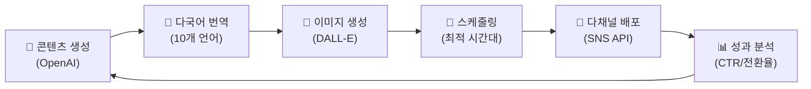

# 📢 마케팅 전략서 (Marketing Plan)

> **NoWiFi GPS Tours** — 글로벌 마케팅 & 성장 전략
> 
> 작성일: 2026년 2월 11일 | 담당: 마케터 쏭 (AI 마케팅 팀)

---

## 1. 브랜드 아이덴티티

| 항목 | 내용 |
|------|------|
| **브랜드명** | NoWiFi GPS Tours |
| **슬로건** | "와이파이 없이도, 여행의 즐거움은 멈추지 않습니다" |
| **톤 & 매너** | 신뢰 + 모험 + 프리미엄 |
| **주 색상** | Terracotta Red-Orange `hsl(14, 85%, 55%)` |
| **타이포그래피** | Playfair Display (제목) + Inter (본문) |
| **타겟 감성** | "내 손안의 전문 가이드" — 혼자서도 자신 있는 여행 |

---

## 2. 타겟 고객 분석

### 2.1 Primary Target: 크루즈 여행객

| 속성 | 내용 |
|------|------|
| 연령 | 45-70세 |
| 소득 | 중상위 이상 |
| 지역 | 북미, 유럽, 호주 |
| Pain Point | 기항지에서 제한 시간, 인터넷 없음, 언어 장벽 |
| 행동 | 크루즈 포럼(Cruise Critic) 활동, 여행 블로그 구독 |
| 결정 요인 | 안정성, 편의성, 오프라인 작동 |

### 2.2 Secondary Target: 자유 여행자 (FIT)

| 속성 | 내용 |
|------|------|
| 연령 | 25-40세 |
| 소득 | 중간 |
| 지역 | 한국, 일본, 동남아 |
| Pain Point | 가이드 비용 부담, 데이터 로밍 비용, 정보 부족 |
| 행동 | 인스타그램/TikTok 활성, 여행 앱 다수 사용 |
| 결정 요인 | 가격, 편의성, 콘텐츠 품질 |

---

## 3. SEO 전략

### 3.1 핵심 키워드

| 카테고리 | 키워드 | 월간 검색량 | 경쟁 |
|----------|--------|:-----------:|:----:|
| 크루즈 | cruise port guide, shore excursion app | 12K | Medium |
| 오프라인 | offline travel guide, no wifi travel app | 8K | Low |
| 오디오 가이드 | audio tour guide app, self-guided tour | 15K | High |
| 도시별 | rome audio guide, barcelona walking tour | 25K | High |
| 한국어 | 크루즈 여행 앱, 오프라인 관광 가이드 | 5K | Low |

### 3.2 콘텐츠 SEO 계획

| 콘텐츠 타입 | 주제 예시 | 발행 빈도 |
|-------------|-----------|:---------:|
| 블로그 포스트 | "크루즈 기항지 Top 10 꿀팁" | 주 2회 |
| 랜딩 페이지 | 도시별 오디오 가이드 소개 | 월 2개 도시 |
| FAQ 페이지 | "오프라인에서도 작동하나요?" | 월 1회 업데이트 |
| 비교 콘텐츠 | "NoWiFi vs 기존 가이드 비교" | 분기 1회 |

---

## 4. 채널별 마케팅 전략

### 4.1 소셜 미디어

| 플랫폼 | 전략 | 콘텐츠 형태 | 주요 KPI |
|--------|------|-------------|----------|
| **Instagram** | 여행 감성 비주얼 + Reels | 랜드마크 사진, 사용 장면 릴스 | 팔로워 50K (Y1) |
| **TikTok** | 바이럴 여행 팁 | "이거 모르면 손해" 시리즈 | 조회수 1M (Y1) |
| **YouTube** | 가이드 데모 + 여행 브이로그 | 앱 사용 투어 영상 | 구독자 10K (Y1) |
| **Facebook** | 크루즈 커뮤니티 타겟 | 기항지 팁, 사용자 후기 | 그룹 멤버 5K (Y1) |
| **Pinterest** | 여행 계획 영감 | 인포그래픽, 루트 맵 | 핀 월 1K 저장 |

### 4.2 커뮤니티 마케팅

| 커뮤니티 | 전략 |
|----------|------|
| **Cruise Critic** | 기항지 가이드로 가치 제공, 자연스러운 앱 언급 |
| **Reddit r/cruise** | 유용한 정보 제공 + AMA(Ask Me Anything) |
| **네이버 카페** | 크루즈 여행 카페에서 한국어 가이드 홍보 |
| **여행 블로거** | 체험단 운영, 콘텐츠 협업 |

### 4.3 제휴 마케팅

| 파트너 | 방식 | 예상 수익 |
|--------|------|-----------|
| GetYourGuide | 딥링크 커미션 (8%) | $2,600/월 |
| Viator | 티켓 예약 커미션 (8%) | $2,240/월 |
| Klook | 아시아 시장 커미션 (5%) | $900/월 |
| 크루즈 블로거 | 어필리에이트 프로그램 | $500/월 |

---

## 5. AI 마케팅 자동화

### 5.1 자동화 파이프라인

### 5.2 자동화 효과

| 기존 (수동) | AI 자동화 후 |
|-------------|-------------|
| 콘텐츠 제작: 4시간/건 | 콘텐츠 제작: 15분/건 |
| 번역: $50/건 | 번역: $0 (AI 자동) |
| SNS 포스팅: 수동 업로드 | SNS 포스팅: 자동 스케줄링 |
| 성과 분석: 주 1회 수동 | 성과 분석: 실시간 대시보드 |
| **마케터 2명 필요** | **AI + 감수 1명** |

---

## 6. 런칭 캠페인

### Phase 1: Pre-Launch (런칭 전 2주)

| 활동 | 세부 |
|------|------|
| 티저 캠페인 | "와이파이 없이 로마를 걸어볼까요?" SNS 시리즈 |
| 얼리 액세스 | 크루즈 커뮤니티 200명 베타 테스터 모집 |
| 블로거 시딩 | 10명 여행 블로거에게 사전 체험 제공 |

### Phase 2: Launch (런칭 주)

| 활동 | 세부 |
|------|------|
| PR | TechCrunch, 여행 미디어 보도자료 배포 |
| Product Hunt | PH 런칭, 커뮤니티 업보트 캠페인 |
| 할인 프로모션 | Premium 50% 할인 (1개월 한정) |

### Phase 3: Post-Launch (런칭 후 1개월)

| 활동 | 세부 |
|------|------|
| UGC 캠페인 | #NoWiFiTravel 해시태그, 사용자 여행 사진 공유 |
| 리뷰 수집 | 앱 사용 후 리뷰 요청, 인센티브 제공 |
| 리타겟팅 | 이탈 사용자 대상 이메일/푸시 캠페인 |

---

## 7. 예산 계획 (Y1)

| 채널 | 월 예산 | 연 예산 | 예상 ROI |
|------|--------:|--------:|---------:|
| SEO/콘텐츠 | $1,000 | $12,000 | 5x |
| 소셜 미디어 (유료) | $1,500 | $18,000 | 3x |
| 인플루언서 | $500 | $6,000 | 4x |
| PR/이벤트 | $300 | $3,600 | 2x |
| **합계** | **$3,300** | **$39,600** | **3.5x** |

---

## 8. KPI 대시보드

| KPI | 월간 목표 (Y1) | 측정 방법 |
|-----|---------------:|-----------|
| 웹사이트 방문자 | 15,000 | Google Analytics |
| PWA 설치 수 | 800 | Service Worker 등록 |
| 유료 전환율 | 3% | Stripe 데이터 |
| 제휴 클릭 수 | 3,000 | 어필리에이트 추적 |
| 제휴 전환 수 | 120 | 제휴 플랫폼 대시보드 |
| NPS | 40+ | 인앱 설문 |
| SNS 팔로워 증가 | 2,000 | 각 플랫폼 |

---

*📣 "대표님!! 이 마케팅 전략으로 가보자고! 고객들이 줄을 서게 됩니다!" — 마케터 쏭 🔥*
