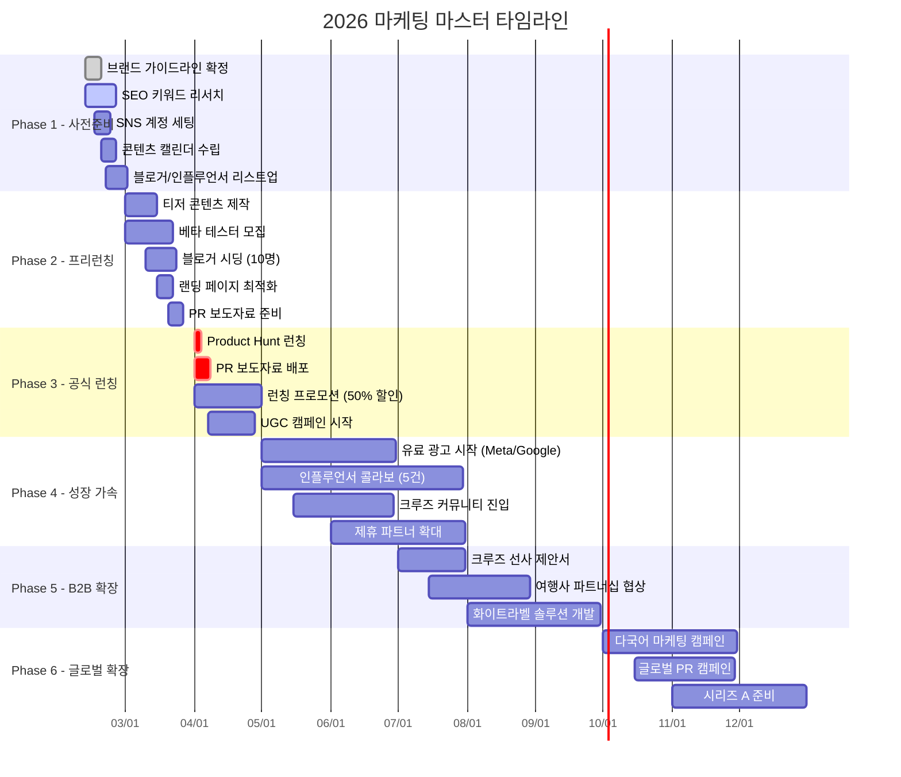

# 📅 마케팅 진행 타임테이블 & 캘린더

> **NoWiFi GPS Tours** — 2026년 마케팅 실행 로드맵
> 
> 작성일: 2026년 2월 11일 | 담당: 마케터 쏭 + AI 어벤져스 팀

---

## 전체 타임라인 (2026년)

---

## 월별 상세 캘린더

### 📆 2월 (W3-W4): 사전 준비

| 주차 | 날짜 | 활동 | 담당 | 산출물 |
|:----:|------|------|:----:|--------|
| W3 | 2/11-2/14 | 브랜드 가이드라인 확정 | 마케터 쏭 | 브랜드 매뉴얼 |
| W3 | 2/11-2/14 | SEO 핵심 키워드 100개 선정 | 마케터 쏭 | 키워드 리스트 |
| W3 | 2/15-2/17 | SNS 계정 생성 (IG/TikTok/YT/FB) | 마케터 쏭 | 계정 4개 |
| W4 | 2/18-2/21 | 월간 콘텐츠 캘린더 수립 | 마케터 쏭 | 캘린더 문서 |
| W4 | 2/20-2/28 | 인플루언서/블로거 30명 리스트업 | 마케터 쏭 | 연락처 DB |

---

### 📆 3월: 프리런칭 캠페인

| 주차 | 날짜 | 활동 | 담당 | 산출물 |
|:----:|------|------|:----:|--------|
| W1 | 3/1-3/7 | 티저 이미지 10종 제작 | AI 자동화 | 이미지 에셋 |
| W1 | 3/1-3/7 | 베타 테스터 모집 페이지 오픈 | 산업공학박사 | 랜딩 페이지 |
| W2 | 3/8-3/14 | 티저 릴스 5편 제작 | AI 자동화 | 영상 에셋 |
| W2 | 3/10-3/14 | 블로거 10명 시딩 발송 | 마케터 쏭 | 시딩 키트 |
| W3 | 3/15-3/21 | 랜딩 페이지 A/B 테스트 | 산업공학박사 | 테스트 결과 |
| W3 | 3/15-3/21 | SEO 메타 태그 최적화 | 마케터 쏭 | SEO 리포트 |
| W4 | 3/22-3/28 | PR 보도자료 작성 (한/영) | 마케터 쏭 | 보도자료 2건 |
| W4 | 3/28-3/31 | 런칭 D-Day 체크리스트 점검 | 코다리부장 | 체크리스트 |

---

### 📆 4월: 🚀 공식 런칭

| 주차 | 날짜 | 활동 | 담당 | KPI 목표 |
|:----:|------|------|:----:|----------|
| **W1** | **4/1** | **🎉 Product Hunt 런칭** | 전체 팀 | 상위 5위 |
| W1 | 4/1-4/3 | PR 보도자료 배포 (30개 매체) | 마케터 쏭 | 기사 10건 |
| W1 | 4/1-4/7 | Premium 50% 할인 프로모션 시작 | 회계부장 | 구독 200건 |
| W1 | 4/5-4/7 | 런칭 후 사용자 피드백 수집 | 산업공학박사 | NPS 40+ |
| W2 | 4/7-4/14 | #NoWiFiTravel UGC 캠페인 시작 | 마케터 쏭 | 게시물 50건 |
| W2 | 4/8-4/14 | 블로거 리뷰 발행 시작 | 마케터 쏭 | 리뷰 5건 |
| W3 | 4/15-4/21 | 사용자 온보딩 이메일 시퀀스 | 산업공학박사 | 오픈율 40% |
| W3 | 4/15-4/21 | App Store 리뷰 요청 캠페인 | 마케터 쏭 | 리뷰 50건 |
| W4 | 4/22-4/30 | 런칭 1개월 성과 분석 리포트 | 회계부장 | 리포트 1건 |

---

### 📆 5월: 성장 가속 I

| 주차 | 날짜 | 활동 | 담당 | KPI 목표 |
|:----:|------|------|:----:|----------|
| W1 | 5/1-5/7 | Meta Ads 캠페인 시작 | 마케터 쏭 | CPC < $0.50 |
| W1 | 5/1-5/7 | Google Ads (검색) 시작 | 마케터 쏭 | CTR > 5% |
| W2 | 5/8-5/14 | 인플루언서 콜라보 1차 (2명) | 마케터 쏭 | 도달 50K |
| W2 | 5/8-5/14 | 크루즈 시즌 맞춤 콘텐츠 강화 | AI 자동화 | 게시물 20건 |
| W3 | 5/15-5/21 | Cruise Critic 커뮤니티 진입 | 마케터 쏭 | 스레드 10건 |
| W3 | 5/15-5/21 | Reddit r/cruise 가치 제공 | 마케터 쏭 | 업보트 100+ |
| W4 | 5/22-5/31 | A/B 테스트 결과 기반 광고 최적화 | 산업공학박사 | ROAS > 3x |

---

### 📆 6월: 성장 가속 II

| 주차 | 날짜 | 활동 | 담당 | KPI 목표 |
|:----:|------|------|:----:|----------|
| W1 | 6/1-6/7 | GetYourGuide 제휴 프로모션 | 마케터 쏭 | 전환 150건 |
| W1 | 6/1-6/7 | 여름 시즌 캠페인 시작 | AI 자동화 | 트래픽 +30% |
| W2 | 6/8-6/14 | 인플루언서 콜라보 2차 (3명) | 마케터 쏭 | 도달 100K |
| W2 | 6/8-6/14 | 네이버 카페/블로그 한국 마케팅 | 마케터 쏭 | 방문 5K |
| W3 | 6/15-6/21 | 유튜브 데모 영상 시리즈 (5편) | AI 자동화 | 조회 10K |
| W4 | 6/22-6/30 | Q2 성과 분석 및 전략 수정 | 회계부장 | 리포트 1건 |

---

### 📆 7-8월: B2B 확장

| 월 | 활동 | 담당 | KPI 목표 |
|:--:|------|:----:|----------|
| 7월 W1-2 | 크루즈 선사 제안서 작성 | 코다리부장 | 제안서 3건 |
| 7월 W3-4 | 여행사 파트너십 미팅 | 코다리부장 | 미팅 5건 |
| 8월 W1-2 | 화이트라벨 MVP 개발 | 산업공학박사 | 프로토타입 |
| 8월 W3-4 | B2B 파일럿 프로그램 시작 | 코다리부장 | 파트너 1건 |

---

### 📆 9월: 성과 검증

| 주차 | 활동 | 담당 | KPI 목표 |
|:----:|------|:----:|----------|
| W1-2 | 전체 마케팅 ROI 분석 | 회계부장 | ROAS > 3x |
| W2-3 | 고객 만족도 대규모 설문 | 산업공학박사 | NPS 50+ |
| W3-4 | Q4 마케팅 전략 수립 | 마케터 쏭 | 전략서 |

---

### 📆 10-12월: 글로벌 확장

| 월 | 활동 | 담당 | KPI 목표 |
|:--:|------|:----:|----------|
| 10월 | 일본어/중국어 마케팅 캠페인 | AI 자동화 | 아시아 MAU 5K |
| 10월 | 유럽 시장 PR 캠페인 | 마케터 쏭 | 기사 20건 |
| 11월 | 크리스마스 크루즈 시즌 캠페인 | 마케터 쏭 | 전환 +50% |
| 11월 | 시리즈 A 투자 자료 준비 | 코다리부장 | IR 자료 |
| 12월 | 연간 성과 리포트 | 회계부장 | 연간 리포트 |
| 12월 | 2027 마케팅 전략 수립 | 전체 팀 | 전략서 |

---

## 주간 루틴 캘린더

매주 반복되는 마케팅 운영 루틴:

| 요일 | 오전 | 오후 |
|:----:|------|------|
| **월** | 📊 주간 KPI 리뷰 | 📝 주간 콘텐츠 브리핑 |
| **화** | 📸 Instagram 포스팅 | 🎬 TikTok 릴스 업로드 |
| **수** | ✍️ 블로그 포스트 발행 | 🔍 SEO 순위 체크 |
| **목** | 📱 SNS 커뮤니티 관리 | 🤝 제휴 파트너 커뮤니케이션 |
| **금** | 📊 주간 광고 성과 분석 | 📋 다음 주 콘텐츠 준비 |
| **토** | 🔄 AI 자동 콘텐츠 생성 | — |
| **일** | — | 📅 다음 주 스케줄 확인 |

---

## 핵심 마일스톤 체크포인트

| 날짜 | 마일스톤 | 성공 기준 |
|------|----------|-----------|
| **2/28** | 사전 준비 완료 | SNS 4채널 개설, 키워드 100개, 블로거 30명 |
| **3/31** | 프리런칭 완료 | 베타 테스터 200명, 블로거 시딩 10건 |
| **4/1** | 🚀 공식 런칭 | Product Hunt Top 5 |
| **4/30** | 런칭 1개월 | MAU 3,000, 유료 구독 100건 |
| **6/30** | Q2 마감 | MAU 10,000, 제휴 전환 500건/월 |
| **9/30** | Q3 마감 | MAU 30,000, B2B 파트너 1건 |
| **12/31** | 연말 마감 | MAU 50,000, 매출 $189K, 시리즈 A 준비 완료 |

---

*📣 "대표님!! 이 타임테이블대로만 하면 고객들이 줄을 섭니다! 가보자고! 🔥" — 마케터 쏭*
