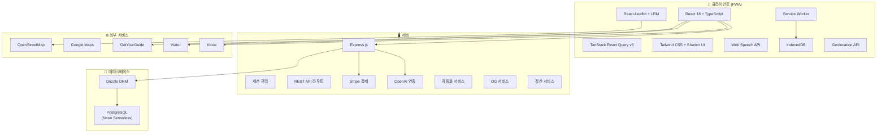
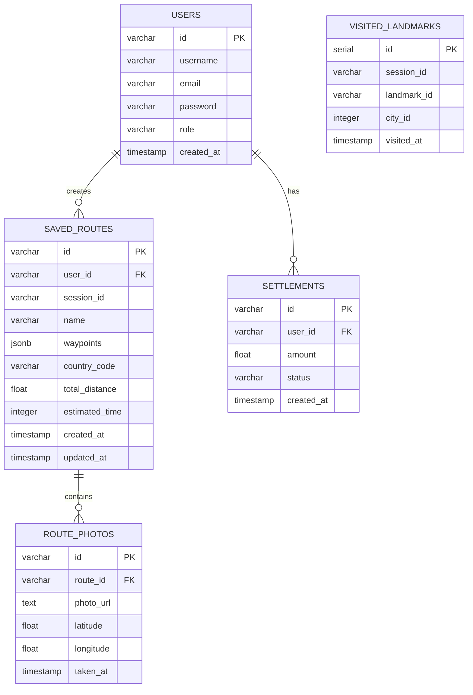

# 🔧 기술 사양서 (Technical Specification)

> **NoWiFi GPS Tours** — 시스템 아키텍처 및 기술 사양
> 
> 작성일: 2026년 2월 11일 | 버전: 1.0

---

## 1. 시스템 개요

NoWiFi GPS Tours는 **React 기반 PWA** 애플리케이션으로, 오프라인 환경에서도 완전히 작동하는 GPS 오디오 가이드 플랫폼입니다.

### 아키텍처 다이어그램



---

## 2. 프론트엔드 사양

### 2.1 기술 스택

| 기술 | 버전 | 용도 |
|------|------|------|
| React | 18.x | UI 프레임워크 |
| TypeScript | 5.x | 타입 안전성 |
| Vite | 5.x | 빌드 도구 |
| TanStack React Query | v5 | 서버 상태 관리 |
| Wouter | 3.x | 클라이언트 라우팅 |
| Tailwind CSS | 3.x | 유틸리티 CSS |
| Shadcn UI | latest | UI 컴포넌트 라이브러리 |
| React-Leaflet | 4.x | 지도 렌더링 |
| Leaflet Routing Machine | 3.x | 경로 계산 |

### 2.2 페이지 구조

| 경로 | 컴포넌트 | 설명 |
|------|----------|------|
| `/` | RoleSelection | 역할 선택 (고객/가이드/투어리더/관리자) |
| `/home` | Home | 메인 대시보드 (지도 + 랜드마크) |
| `/guide` | GuideView | 가이드 전용 인터페이스 |
| `/tour-leader` | TourLeaderView | 투어 리더 인터페이스 |
| `/admin` | Admin | 관리자 대시보드 |
| `/my-routes` | MyRoutes | 저장된 경로 관리 |

### 2.3 핵심 컴포넌트

| 컴포넌트 | 파일 | 기능 |
|----------|------|------|
| Home | `pages/Home.tsx` | 메인 지도, 랜드마크 목록, 필터 |
| LandmarkDetailDialog | `components/LandmarkDetailDialog.tsx` | 랜드마크 상세 정보 모달 |
| CruisePortInfo | `components/CruisePortInfo.tsx` | 크루즈 기항지 정보 카드 |
| SettingsDialog | `components/SettingsDialog.tsx` | 언어, 속도 등 사용자 설정 |
| CreatorDashboard | `components/CreatorDashboard.tsx` | 크리에이터 대시보드 |
| OfflineIndicator | `components/OfflineIndicator.tsx` | 오프라인 상태 표시 |

### 2.4 오프라인 기능

#### Service Worker 캐싱 전략

| 캐시 이름 | 전략 | 대상 |
|-----------|------|------|
| `STATIC_CACHE` | Cache First | manifest.json, 아이콘 |
| `DYNAMIC_CACHE` | Network First | CSS, 이미지, JS |
| `MAP_TILES_CACHE` | Cache First | OpenStreetMap 타일 |
| `API_CACHE` | Network First, Cache Fallback | API 응답 (/api/*) |

#### IndexedDB 스토어

| 스토어 | 키 | 데이터 |
|--------|-----|--------|
| `cities` | cityId | 도시 정보 JSON |
| `landmarks` | landmarkId | 랜드마크 데이터 JSON |
| `metadata` | key | 다운로드/버전 메타데이터 |
| `visitedQueue` | auto | 오프라인 방문 기록 큐 |
| `audioFiles` | audioId | 캐시된 오디오 파일 |

---

## 3. 백엔드 사양

### 3.1 기술 스택

| 기술 | 버전 | 용도 |
|------|------|------|
| Express.js | 4.x | HTTP 서버 |
| TypeScript | 5.x | 타입 안전성 |
| tsx | latest | TypeScript 실행 |
| Drizzle ORM | latest | DB 쿼리 빌더 |
| Zod | 3.x | 스키마 검증 |
| Stripe | latest | 결제 처리 |

### 3.2 API 엔드포인트

#### 도시 API

| 메서드 | 경로 | 설명 |
|--------|------|------|
| GET | `/api/cities` | 모든 도시 목록 |
| GET | `/api/cities/:id` | 특정 도시 상세 |

#### 랜드마크 API

| 메서드 | 경로 | 설명 |
|--------|------|------|
| GET | `/api/landmarks?cityId={id}` | 도시별 랜드마크 |
| GET | `/api/landmarks/:id` | 특정 랜드마크 상세 |

#### 방문 기록 API

| 메서드 | 경로 | 설명 |
|--------|------|------|
| POST | `/api/visited` | 방문 기록 저장 |
| GET | `/api/visited?sessionId={id}` | 세션별 방문 목록 |
| GET | `/api/visited/count?sessionId={id}` | 방문 수 조회 |
| GET | `/api/visited/:landmarkId?sessionId={id}` | 특정 방문 확인 |

#### 경로 API

| 메서드 | 경로 | 설명 |
|--------|------|------|
| POST | `/api/saved-routes` | 경로 저장 |
| GET | `/api/saved-routes` | 저장된 경로 목록 |
| PUT | `/api/saved-routes/:id` | 경로 수정 |
| DELETE | `/api/saved-routes/:id` | 경로 삭제 |

#### 결제 API

| 메서드 | 경로 | 설명 |
|--------|------|------|
| POST | `/api/create-payment-intent` | 결제 의도 생성 |
| POST | `/api/webhook/stripe` | Stripe 웹훅 |

---

## 4. 데이터베이스 스키마

### 4.1 ERD



### 4.2 주요 테이블

| 테이블 | 설명 | 레코드 규모 |
|--------|------|:-----------:|
| `users` | 사용자 계정 | ~100K |
| `visited_landmarks` | 방문 기록 | ~1M |
| `saved_routes` | 저장된 경로 | ~50K |
| `route_photos` | 경로 사진 | ~200K |
| `settlements` | 정산 기록 | ~10K |

---

## 5. 보안 사양

| 항목 | 구현 |
|------|------|
| 세션 관리 | express-session + localStorage |
| HTTPS | TLS 1.3 (프로덕션) |
| 외부 링크 | `noopener, noreferrer` 적용 |
| 입력 검증 | Zod 스키마 검증 |
| 결제 보안 | Stripe PCI DSS 준수 |
| API 키 | 환경 변수로 관리 (`.env`) |
| CORS | 동일 출처 정책 적용 |

---

## 6. 성능 사양

| 지표 | 목표 |
|------|------|
| 첫 로딩 (FCP) | < 1.5초 |
| 인터랙티브 (TTI) | < 3.0초 |
| 오프라인 로딩 | < 0.5초 |
| API 응답 시간 | < 200ms |
| 지도 타일 로딩 | < 1.0초 |
| Lighthouse 점수 | > 90 (PWA) |
| 번들 크기 | < 500KB (gzipped) |

---

## 7. 인프라 사양

| 항목 | 서비스 | 비용 (월) |
|------|--------|----------:|
| 데이터베이스 | Neon PostgreSQL (Serverless) | $19 |
| 호스팅 | Vercel / Replit | $20 |
| CDN | Cloudflare (Free tier) | $0 |
| 도메인 | nowifigps.tours | $15/년 |
| 모니터링 | Sentry (Free tier) | $0 |
| AI API | OpenAI API | ~$50 |
| 결제 | Stripe (2.9% + 30¢) | 변동 |
| **합계** | | **~$100** |

---

## 8. 배포 환경

| 환경 | URL | 용도 |
|------|-----|------|
| Development | `http://localhost:5000` | 로컬 개발 |
| Staging | TBD | 테스트/QA |
| Production | `https://nowifigps.tours` | 프로덕션 서비스 |

### 배포 명령

```bash
# 개발 서버 (Windows)
npm run dev

# 프로덕션 빌드
npm run build

# 프로덕션 실행
npm start
```

---

*⚙️ "대표님, 이 시스템은 확장성과 효율성의 최적해(Optimum)를 찾았습니다." — 산업공학박사 📈*
