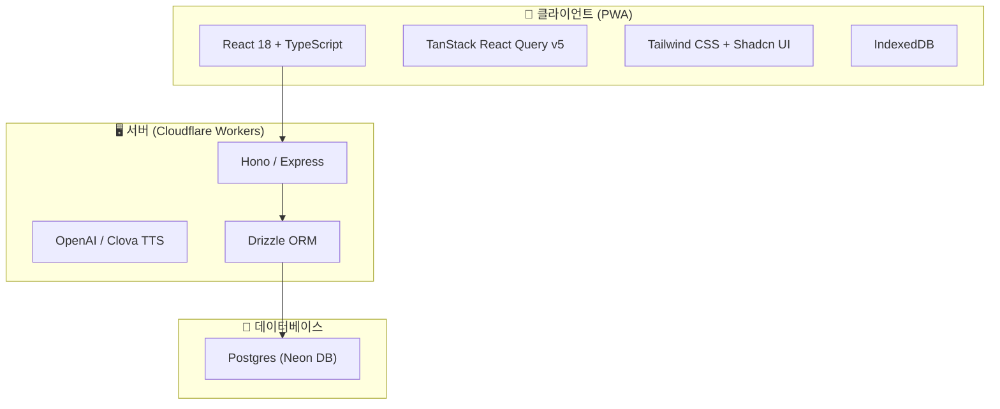

# 🔧 기술 사양서 (Technical Specification)

> **NoWiFi GPS Tours** — 시스템 아키텍처 및 기술 사양
> 작성일: 2026년 2월 23일 | 버전: 1.1

---

> **NoWiFi GPS Tours** — System Architecture & Technical Specs
> Date: Feb 23, 2026 | Version: 1.1

## 1. 시스템 개요
NoWiFi GPS Tours는 **React 기반 PWA** 애플리케이션으로, 오프라인 환경에서도 완전히 작동하는 GPS 오디오 가이드 플랫폼입니다.

---

## 1. System Overview
NoWiFi GPS Tours is a **React-based PWA** application, a GPS audio guide platform that works fully in offline environments.

### 아키텍처 다이어그램 (Architecture Diagram)

---

## 2. 프론트엔드 사양
### 2.1 기술 스택 (Tech Stack)
| 기술 | 용도 |
|------|------|
| React 18 | UI 프레임워크 |
| Vite | 빌드 도구 |
| Tailwind CSS | 스타일링 |
| IndexedDB | 로컬 데이터 캐싱 |

---

## 2. Frontend Specification
### 2.1 Tech Stack
| Tech | Purpose |
|------|---------|
| React 18 | UI Framework |
| Vite | Build Tool |
| Tailwind CSS | Styling |
| IndexedDB | Local Data Caching |

> [!NOTE]
> **교수님의 조언**: "기술은 목적을 위한 수단일 뿐입니다. 오프라인에서도 사용자에게 감동을 주는 UX가 우리 기술의 핵심 지표입니다!"
