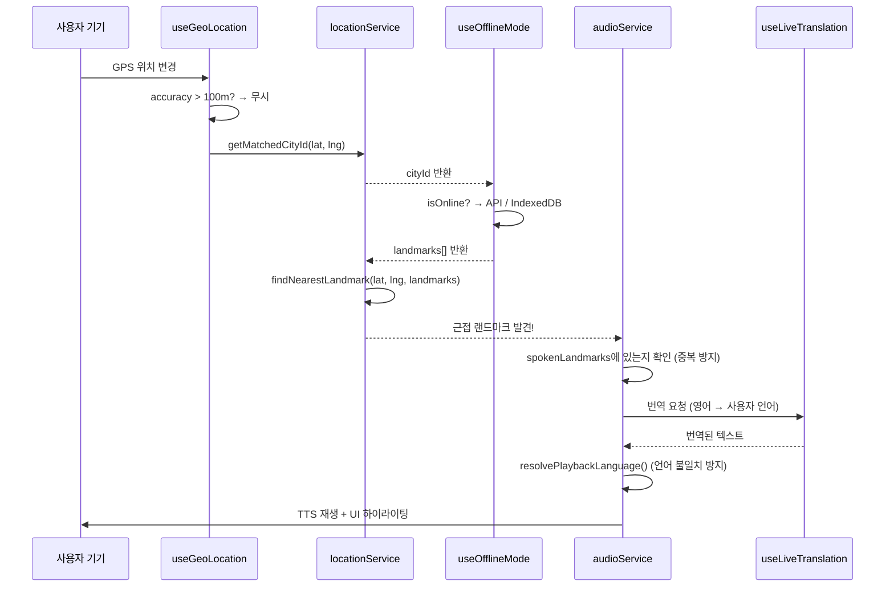

# Chapter 5: GPS & 근접 탐지 시스템
> `client/src/lib/geoUtils.ts` + `client/src/lib/locationService.ts` + `client/src/hooks/useGeoLocation.ts`

---

## 5.1 Haversine 공식 — 지구 위의 두 점 사이 거리 계산

```typescript
// client/src/lib/geoUtils.ts
export function calculateDistance(
  lat1: number, lon1: number,
  lat2: number, lon2: number
): number {
  const R = 6371000; // 지구 반지름 (미터)
  const toRad = (value: number) => (value * Math.PI) / 180;

  const dLat = toRad(lat2 - lat1);
  const dLon = toRad(lon2 - lon1);

  const a =
    Math.sin(dLat / 2) ** 2 +
    Math.cos(toRad(lat1)) * Math.cos(toRad(lat2)) * Math.sin(dLon / 2) ** 2;

  const c = 2 * Math.atan2(Math.sqrt(a), Math.sqrt(1 - a));

  return R * c; // 결과: 미터 단위
}

// 사용자 친화적 거리 포맷
export function formatDistance(meters: number): string {
  if (meters < 1000) return `${Math.round(meters)}m`;
  return `${(meters / 1000).toFixed(1)}km`;
}
```

**왜 Haversine인가:** 지구가 구형이므로 단순 좌표 차이 계산은 부정확. 특히 위도가 높은 알래스카 등에서 오차가 심해짐.

---

## 5.2 도시 매칭 시스템

사용자의 GPS 좌표를 받아 **어느 도시에 있는지** 판별:

```typescript
// client/src/lib/locationService.ts

// 거점 도시 데이터베이스 (폴백용)
export const CITY_HUBS: CityHub[] = [
  { id: 'rome',         lat: 41.8902, lng: 12.4922,  radiusMeters: 50000 },
  { id: 'civitavecchia', lat: 42.0925, lng: 11.7954,  radiusMeters: 20000 },
  { id: 'cebu',         lat: 10.3157, lng: 123.8854, radiusMeters: 30000 },
  { id: 'tokyo',        lat: 35.6895, lng: 139.6917, radiusMeters: 40000 },
  { id: 'paris',        lat: 48.8566, lng: 2.3522,   radiusMeters: 30000 },
  { id: 'barcelona',    lat: 41.3851, lng: 2.1734,   radiusMeters: 30000 },
];

export function getMatchedCityId(
  lat: number, lng: number,
  cities: any[] = []     // DB에서 가져온 동적 도시 데이터
): string | null {
  // DB 데이터가 있으면 우선 사용, 없으면 CITY_HUBS 폴백
  const targets = cities.length > 0 ? cities : CITY_HUBS;

  for (const city of targets) {
    const distance = calculateDistance(lat, lng, city.lat, city.lng);
    const radius = city.radiusMeters || 50000; // 기본 50km

    if (distance <= radius) {
      return city.id;  // 매칭된 도시 ID 반환
    }
  }
  return null; // 어떤 도시에도 속하지 않음
}
```

---

## 5.3 랜드마크 근접 탐지 — GPS 오차 보정 포함

```typescript
export function findNearestLandmark(
  userLat: number,
  userLng: number,
  landmarks: Landmark[],
  excludeIds: Set<string> = new Set(),  // 이미 안내된 랜드마크
  gpsAccuracy: number = 0               // GPS 정확도 (미터)
): ProximityResult | null {
  let nearest: ProximityResult | null = null;
  let minDistance = Infinity;

  // [핵심] GPS 오차를 고려한 반경 보정
  // accuracy가 클수록 감지 반경을 소폭 확대 (최대 30m 제한)
  const accuracyBonus = Math.min(gpsAccuracy * 0.5, 30);

  for (const landmark of landmarks) {
    // 이미 안내된 랜드마크는 건너뛰기
    if (excludeIds.has(landmark.id)) continue;

    const distance = calculateDistance(userLat, userLng, landmark.lat, landmark.lng);

    // 랜드마크 기본 반경 (50m) + GPS 오차 보정
    const effectiveRadius = (landmark.radius || 50) + accuracyBonus;

    if (distance <= effectiveRadius && distance < minDistance) {
      minDistance = distance;
      nearest = { landmark, distance };
    }
  }

  if (nearest) {
    console.log(`📡 Nearest: ${nearest.landmark.id} ` +
      `(${Math.round(nearest.distance)}m, radius: ${nearest.landmark.radius}m, ` +
      `bonus: ${Math.round(accuracyBonus)}m)`);
  }

  return nearest;
}
```

### 설계 결정: accuracyBonus

| GPS 정확도 | 보정값 | 실효 반경 (기본 50m) |
|---|---|---|
| 5m (좋음) | +2.5m | 52.5m |
| 20m (보통) | +10m | 60m |
| 50m (나쁨) | +25m | 75m |
| 100m (매우 나쁨) | +30m (제한) | 80m |

---

## 5.4 useGeoLocation 훅 — GPS 실시간 추적

```typescript
// client/src/hooks/useGeoLocation.ts
export function useGeoLocation(
  enabled: boolean = true,
  simulatedPosition: GpsPosition | null = null  // 개발/테스트용
) {
  const [position, setPosition] = useState<GpsPosition | null>(null);
  const [error, setError] = useState<string | null>(null);
  const [isLoading, setIsLoading] = useState(true);

  useEffect(() => {
    // 시뮬레이션 모드 — 개발 시 실제 GPS 없이 테스트
    if (simulatedPosition) {
      setPosition(simulatedPosition);
      setIsLoading(false);
      return;
    }

    if (!navigator.geolocation) {
      setError('Geolocation is not supported');
      return;
    }

    const watchId = navigator.geolocation.watchPosition(
      (pos) => {
        // ★ 핵심: 정확도 필터링
        // accuracy > 100m → 부정확한 GPS 신호 → 무시
        // 실내, 터널, 고층 빌딩 사이에서 잘못된 트리거 방지
        if (pos.coords.accuracy > 100) {
          console.log(`⚠️ 정확도 낮음: ${Math.round(pos.coords.accuracy)}m — 무시`);
          return;
        }

        setPosition({
          latitude: pos.coords.latitude,
          longitude: pos.coords.longitude,
          accuracy: pos.coords.accuracy,
          timestamp: pos.timestamp,
        });
        setError(null);
        setIsLoading(false);
      },
      (err) => setError(err.message),
      {
        enableHighAccuracy: true,  // 정밀 GPS 모드
        timeout: 15000,            // 15초 타임아웃 (터널/실내 대응)
        maximumAge: 3000,          // 3초 캐시 재사용 (배터리 절약)
      }
    );

    return () => navigator.geolocation.clearWatch(watchId);
  }, [enabled, simulatedPosition]);

  return { position, error, isLoading };
}
```

---

## 5.5 useLiveTranslation 훅 — 실시간 번역 + 캐싱

```typescript
// client/src/hooks/useLiveTranslation.ts
export function useLiveTranslation(
  text: string | null | undefined,
  targetLanguage: string
): string {
  const [translated, setTranslated] = useState(text || '');

  useEffect(() => {
    if (!text) return;

    // ① 한국어 텍스트 + 한국어 타겟 → API 호출 생략
    const isKorean = /[ㄱ-ㅎ|ㅏ-ㅣ|가-힣]/.test(text);
    if (isKorean && targetLanguage === 'ko') {
      setTranslated(text);
      return;
    }

    setTranslated(text); // 초기값으로 원본 표시

    const fetchTranslation = async () => {
      // ② localStorage 캐시 확인
      const safeTextKey = text.replace(/[^a-zA-Z0-9가-힣]/g, '').substring(0, 30);
      const cacheKey = `trans_${targetLanguage}_${safeTextKey}`;

      const cached = localStorage.getItem(cacheKey);
      if (cached) { setTranslated(cached); return; }

      // ③ API 호출
      const res = await fetch('/api/translate', {
        method: 'POST',
        body: JSON.stringify({ text, targetLanguage })
      });

      if (res.ok) {
        const data = await res.json();
        if (data.translatedText) {
          setTranslated(data.translatedText);
          localStorage.setItem(cacheKey, data.translatedText); // 캐시 저장
        }
      }
    };

    // ④ 100ms debounce — 빠른 렌더링 시 과도한 API 호출 방지
    const timer = setTimeout(fetchTranslation, 100);
    return () => clearTimeout(timer);
  }, [text, targetLanguage]);

  return translated;
}
```

---

## 5.6 전체 데이터 흐름: GPS → 오디오 트리거



---

> **다음 챕터:** [CH06 트러블슈팅 케이스북](./CH06_트러블슈팅_케이스북.md) — 실전에서 만난 버그들과 해결 과정
