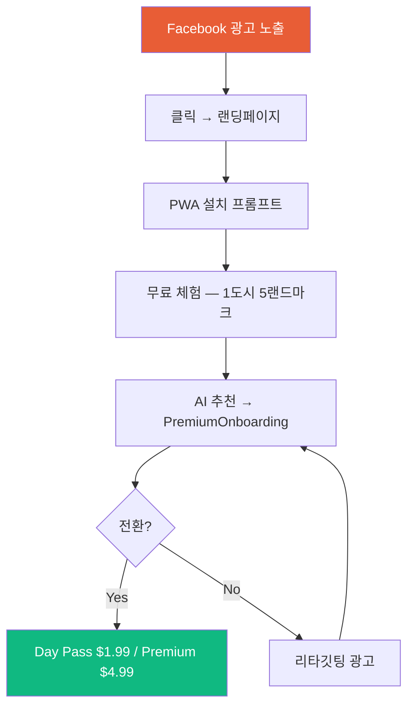

# Chapter 11: Facebook/Meta Ads 전략
> BMAD 3인 협업: Analyst(타깃팅) + 마케터 송(크리에이티브) + 도다리(퍼널/예산)

---

## Part 1: 타깃 오디언스 (Analyst)

### 4개 핵심 세그먼트

#### 세그먼트 A: 크루즈 애호가

| 파라미터 | 설정값 |
|---|---|
| **연령** | 35–65 |
| **위치** | 미국, 영국, 캐나다, 호주, 독일 |
| **Interest** | `Cruise ship`, `Royal Caribbean International`, `Carnival Cruise Lines`, `Norwegian Cruise Line`, `MSC Cruises`, `Shore excursion`, `Port of call`, `CruiseCritic.com` |
| **Behavior** | `Frequent international travelers`, `Returned from trip 1-2 weeks ago` |
| **예상 규모** | 12M–18M |
| **일일 예산** | $30–$50 |

#### 세그먼트 B: 예산 중심 여행자

| 파라미터 | 설정값 |
|---|---|
| **연령** | 25–55 |
| **위치** | 미국, 영국, 캐나다, 호주 |
| **Interest** | `Budget travel`, `TripAdvisor`, `Walking tour`, `Self-guided tour`, `Audio guide`, `Lonely Planet` |
| **Narrowing (AND)** | 위 Interest + (`Cruise ship` OR `Ocean vacation`) |
| **예상 규모** | 8M–15M |
| **일일 예산** | $20–$35 |

#### 세그먼트 C: 중국어권 여행자

| 파라미터 | 설정값 |
|---|---|
| **연령** | 28–60 |
| **위치** | 미국, 캐나다, 호주, 싱가포르, 홍콩, 대만 (본토 제외) |
| **언어** | Chinese (Simplified/Traditional) |
| **Interest** | `Travel`, `Cruise ship`, `Shopping tourism`, `Duty-free shopping` |
| **예상 규모** | 2M–5M |
| **일일 예산** | $15–$25 |

> 중국 본토 타깃은 Meta 불가 → Xiaohongshu(小红书) KOL, Douyin(抖音) 별도 운영 필요

#### 세그먼트 D: 시니어 여행자

| 파라미터 | 설정값 |
|---|---|
| **연령** | 45–70 |
| **위치** | 미국, 영국, 캐나다, 호주 |
| **Interest** | `Retirement travel`, `AARP`, `Viking River Cruises`, `Holland America Line`, `National Geographic Traveler` |
| **예상 규모** | 6M–10M |
| **일일 예산** | $25–$40 |

> 핵심 메시지: **"앱 설치 불필요 — QR코드만 스캔하세요"** (기술 장벽 제거)

### Lookalike Audience 전략

| 시드 오디언스 | LAL % | 용도 | 예산 비중 |
|---|---|---|---|
| Premium 구독 전환자 | **1%** | 핵심 전환 | 50% |
| Day Pass 구매자 | **3%** | 확장 스케일 | 30% |
| 앱 활성 사용자 (30일 3회+) | **5%** | 인지도 | 20% |

### 리타깃팅 전략

| 단계 | 오디언스 | 기간 | 메시지 |
|---|---|---|---|
| 방문 미전환 | ViewContent O, Install X | 7일 | "QR 한 번이면 끝 — 무료 시작" |
| 설치 미사용 | Install O, 사용 X | 14일 | "첫 도시가 기다리고 있어요" |
| 무료→유료 | 1+ 청취, 결제 X | 30일 | "$1.99로 하루 종일 투어" |
| 결제 이탈 | Checkout O, Purchase X | 3일 | "결제가 완료되지 않았습니다" |

---

## Part 2: 후킹 카피 & 크리에이티브 (마케터 송)

### 3초 안에 멈추게 하는 Hook 10개

| # | 유형 | 한국어 | English |
|---|---|---|---|
| 1 | **Pain Point** | "크루즈에서 내렸는데 WiFi가 안 터져서 멘붕 온 적 있죠?" | "Ever stepped off a cruise with ZERO signal?" |
| 2 | **Curiosity** | "WiFi 없이 24개국어 AI 가이드가 된다고? 진짜임" | "An AI tour guide WITHOUT WiFi? Yes, it's real." |
| 3 | **Social Proof** | "10,000명의 크루즈 여행자가 가이드북 대신 이걸 선택" | "10,000 cruise travelers ditched the guidebook for THIS" |
| 4 | **FOMO** | "옆 커플은 자유투어, 당신은 왜 $89 쇼어 엑스커전에 갇혀있죠?" | "That couple explored freely while you paid $89..." |
| 5 | **Before/After** | "Before: 항구에서 헤매기 😩 → After: AI가 실시간 안내 🎧" | "Before: Lost at port 😩 → After: AI guiding you 🎧" |
| 6 | **질문형** | "크루즈 항구에서 혼자 돌아다닐 자신 있으세요?" | "Would you wander a foreign port alone with no guide?" |
| 7 | **숫자 충격** | "쇼어 엑스커전 $89 vs AI 가이드 $1.99 — 44배 차이" | "Shore excursion: $89. Our AI guide: $1.99." |
| 8 | **반전형** | "이 앱을 절대 다운받지 마세요... 모험을 원하지 않는다면 😏" | "Do NOT download this... unless you want to explore 😏" |
| 9 | **타깃 호출** | "2026년 지중해 크루즈 예약한 분? 이거 안 깔면 큰일" | "Booked a Mediterranean cruise? You NEED this" |
| 10 | **감성형** | "WiFi가 안 돼도, 여행의 설렘은 멈추지 않습니다" | "Without WiFi, the joy of travel doesn't stop" |

### 광고 카피 5종

#### Version A: Pain Point

```
Primary: 크루즈에서 내렸는데 WiFi 안 터지고, 구글맵 안 되고, 현지 언어는
모르겠고... 😩 NoWiFi GPS Tours는 인터넷 없이 GPS로 항구 도시를 안내하고
AI가 24개 언어로 설명해줍니다.

Headline: 항구에서 WiFi 없이도 자유투어 가능
Description: 오프라인 GPS + AI 가이드 무료 시작
CTA: Install Now
```

#### Version B: Feature

```
Primary:
✅ 100% 오프라인 작동 — WiFi/데이터 불필요
✅ 40개+ 도시 GPS 오디오 투어
✅ 24개 언어 AI 음성 가이드
✅ 실시간 위치 추적

Headline: 오프라인 GPS 투어 앱 — 40개 도시
Description: 무료 시작, Day Pass $1.99
CTA: Learn More
```

#### Version C: Testimonial

```
Primary: "바르셀로나 항구에서 혼자 돌아다녔는데, 이 앱이 현지 가이드처럼
모든 걸 설명해줬어요. WiFi 없이요! 쇼어 엑스커전 $89 아꼈습니다."
— 김지연 ⭐⭐⭐⭐⭐

Headline: "비싼 쇼어 엑스커전 대신 이걸 썼어요"
Description: 5,000+ 리뷰 평균 ⭐ 4.8
CTA: Get Started
```

#### Version D: Urgency

```
Primary: 🚢 크루즈 출항 전 필수 설치! 항구에 도착하면 WiFi가 안 됩니다.
지금 설치하고 도시 데이터를 미리 다운로드하세요.

Headline: 출항 전에 설치 안 하면 늦습니다
Description: 오프라인 데이터 미리 다운로드 필수
CTA: Install Now
```

#### Version E: Storytelling

```
Primary: 산토리니에 도착했을 때, 저는 WiFi 안 되는 골목길에서 길을 잃었습니다.
그때 이 앱이 오프라인으로 GPS 위치를 잡아주고 "왼쪽에 보이는 건물은
1750년에 지어진..." 하고 AI가 설명해줬을 때, 소름이 돋았습니다.

Headline: 산토리니 골목에서 AI가 가이드해준 이야기
Description: WiFi 없이 여행이 달라집니다
CTA: Get Started
```

### 영상 광고 스크립트 3종

#### 15초 (릴스/스토리)

| 시간 | 장면 | 텍스트 오버레이 | 보이스오버 |
|---|---|---|---|
| 0-3초 | 항구에서 폰 "No Signal" | **WiFi 안 터지는 항구 😱** | "크루즈에서 내렸는데 WiFi가 안 돼요" |
| 3-8초 | 앱 화면 — GPS 핀 + AI 음성 | **오프라인으로 AI가 안내 🎧** | "인터넷 없이 GPS로 도시를 안내합니다" |
| 8-12초 | 랜드마크 앞 셀카 | **40개 도시 · 24개 언어** | "40개 도시, 24개 언어" |
| 12-15초 | #E85D36 배경 + 로고 | **무료로 시작 👉** | "지금 무료로 설치하세요" |

#### 30초 (피드)

| 시간 | 장면 | 핵심 |
|---|---|---|
| 0-5초 | 문제 | 항구에서 폰 안 되는 상황 + 쇼어 엑스커전 호객 |
| 5-12초 | 솔루션 | 앱 열면 GPS 잡히고 AI 음성 재생 |
| 12-20초 | 시연 | 지도 이동 + 자동 오디오 + 다국어 전환 |
| 20-25초 | 증거 | ⭐ 4.8 / 5,000+ 리뷰 |
| 25-30초 | CTA | "무료로 시작 — 출항 전에 설치!" |

#### 60초 (상세)

| 시간 | 장면 | 핵심 |
|---|---|---|
| 0-8초 | 크루즈 접안 시네마틱 | "드디어 도착한 꿈의 항구" |
| 8-15초 | 문제 심화 | WiFi X, 쇼어 엑스커전 $89~$150 |
| 15-22초 | 솔루션 등장 | 출항 전 다운로드 → 항구에서 바로 |
| 22-32초 | 기능 상세 | GPS 추적 → AI 자동 재생 → 24개 언어 |
| 32-42초 | 감성 몽타주 | 골목 탐험, 현지 카페, 숨은 명소 |
| 42-50초 | 소셜 프루프 | 리뷰 3개 슬라이드 |
| 50-55초 | 가격 비교 | FREE → $1.99 → $4.99/월 |
| 55-60초 | CTA | "WiFi 없이도 여행의 즐거움은 멈추지 않습니다" |

### 이미지 광고 콘셉트 5종

| # | 유형 | 포맷 | 핵심 비주얼 |
|---|---|---|---|
| 1 | **가격 비교** | 1080x1080 | 좌: $89 Shore Excursion (X) / 우: $1.99 AI Guide (✓) |
| 2 | **카루셀 5장** | 1080x1080 x5 | Hook → 솔루션 → 도시 쇼케이스 → 가격 → CTA |
| 3 | **Before/After** | 1080x1080 | 좌: 헤매는 여행자(회색) / 우: AI 가이드(밝은톤) |
| 4 | **지도 스크린샷** | 1080x1080 | 바르셀로나 지도 + GPS 핀 + 비행기모드 ON 표시 |
| 5 | **폰 목업** | 1080x1080 | 산토리니 배경 + iPhone에 앱 화면 + 가격 뱃지 |

### 디자인 가이드라인

```
브랜드 컬러:
  Primary: #E85D36 (테라코타 오렌지)
  Background: White / #F8F9FA
  Text: #1A1A1A (다크)
  Accent: #10B981 (그린 — 체크마크, "무료")

폰트:
  제목: Bold/Black, 크게 (시니어 가독성)
  본문: Medium, 높은 대비

필수 요소:
  ✅ "비행기 모드 ✈️ ON" 아이콘 (오프라인 강조)
  ✅ 24개 국기 아이콘 (다국어 강조)
  ✅ "앱스토어 불필요" 배지
  ✅ QR 코드 (PWA 직접 접속)
```

---

## Part 3: A/B 테스트 플랜

### 4단계 체계적 최적화

| Phase | 기간 | 테스트 대상 | 일 예산 | 주간 예산 |
|---|---|---|---|---|
| **1. Hook** | 5~7일 | Pain Point vs 가격비교 vs FOMO vs Social Proof | $60~80 | $420~560 |
| **2. 포맷** | 5~7일 | 이미지 vs Before/After vs 카루셀 vs 15초 영상 | $60~80 | $420~560 |
| **3. CTA** | 5~7일 | "무료 시작" vs "$1.99 시작" vs "출항 전 설치" | $60~75 | $420~525 |
| **4. 타깃** | 7~10일 | 크루즈팬 vs 여행앱유저 vs 45세+ vs LAL 1% | $100~150 | $700~1,050 |
| **총합** | **4~5주** | | | **$1,960~$2,695** |

### 승리 선언 기준

| 지표 | 최소 데이터 | 결정 |
|---|---|---|
| CTR | 셀당 1,000 노출 | Hook 승리 |
| CPI | 셀당 30회 설치 | 포맷 승리 |
| CVR (Install→Purchase) | 셀당 50회 설치 | CTA 승리 |

---

## Part 4: 퍼널 & 예산 (도다리)

### 전환 퍼널



### 단계별 예상 전환율

| 단계 | 전환율 | 1,000 클릭 기준 |
|---|---|---|
| 광고 클릭 → 랜딩 도착 | 100% | 1,000명 |
| 랜딩 → PWA 설치 | 15~25% | 150~250명 |
| 설치 → 무료 사용 | 60~70% | 90~175명 |
| 무료 → Day Pass 구매 | 5~10% | 5~18명 |
| Day Pass → 월 구독 | 20~30% | 1~5명 |

### 예산 3단계

#### Tier 1: $5/일 (테스트)

| 항목 | 수치 |
|---|---|
| 월 예산 | $150 |
| 예상 노출 | 30,000~50,000 |
| 예상 클릭 | 300~500 |
| 예상 설치 | 45~125 |
| 예상 구매 | 2~12건 |
| 예상 수익 | $4~$60 (구독 + 어필리에이트) |
| 목적 | **데이터 수집, 크리에이티브 테스트** |
| 기간 | 2~4주 |

#### Tier 2: $20/일 (최적화)

| 항목 | 수치 |
|---|---|
| 월 예산 | $600 |
| 예상 클릭 | 1,200~2,000 |
| 예상 설치 | 180~500 |
| 예상 구매 | 9~50건 |
| 예상 수익 | $45~$250 |
| 목적 | **승리 크리에이티브 스케일링** |
| 기간 | 1~2개월 |
| 전환 조건 | Tier 1에서 CPI < $2.00 달성 시 |

#### Tier 3: $50/일 (스케일링)

| 항목 | 수치 |
|---|---|
| 월 예산 | $1,500 |
| 예상 클릭 | 3,000~5,000 |
| 예상 설치 | 450~1,250 |
| 예상 구매 | 23~125건 |
| 예상 수익 | $115~$625 + 어필리에이트 |
| 목적 | **수익 극대화** |
| 기간 | 지속 |
| 전환 조건 | Tier 2에서 ROAS > 1.5x 달성 시 |

### 시즌별 예산 배분

| 시즌 | 기간 | 타깃 지역 | 예산 비중 |
|---|---|---|---|
| **카리브해** | 11월~4월 | 미국, 카리브해 도시 | 40% |
| **지중해** | 5월~10월 | 유럽, 지중해 도시 | 45% |
| **알래스카** | 5월~9월 | 미국 서부 | 15% |
| 광고 시작 타이밍 | 각 시즌 **1개월 전** 부터 | 예약 시점 타깃 | — |

### Meta Pixel 설정

```javascript
// 필수 이벤트
fbq('track', 'ViewContent');           // 랜딩페이지 도착
fbq('track', 'CompleteRegistration');   // PWA 설치
fbq('track', 'InitiateCheckout');      // 가격 페이지 클릭
fbq('track', 'Purchase', {             // 결제 완료
  value: 1.99,
  currency: 'USD'
});

// 커스텀 이벤트
fbq('trackCustom', 'PWA_Install');     // PWA 홈화면 추가
fbq('trackCustom', 'Audio_Play');      // 오디오 가이드 재생
fbq('trackCustom', 'City_Download');   // 도시 데이터 다운로드
```

### ROI 예측 (월간)

| 항목 | Tier 1 ($5/일) | Tier 2 ($20/일) | Tier 3 ($50/일) |
|---|---|---|---|
| 광고비 | $150 | $600 | $1,500 |
| 구독 수익 | $10~$60 | $45~$250 | $115~$625 |
| 어필리에이트 | $5~$30 | $20~$120 | $50~$300 |
| **총 수익** | **$15~$90** | **$65~$370** | **$165~$925** |
| **ROAS** | 0.1~0.6x | 0.1~0.6x | 0.1~0.6x |
| **손익분기점** | 3~6개월 | 2~4개월 | 2~3개월 |

> 초기에는 ROAS < 1.0이 정상. **LTV(고객 생애 가치)**를 고려하면 구독자 1명의 6개월 LTV = $30이므로, CPA $10 이하면 수익성 확보.

---

## Part 5: 즉시 실행 체크리스트

### Week 1: 기반 구축 ($0)

- [ ] Meta Business Suite 계정 생성
- [ ] Meta Pixel 코드 nowifigps.tours에 설치
- [ ] Custom Conversion 4개 생성 (ViewContent, Install, Checkout, Purchase)
- [ ] UTM 파라미터 표준화 (`utm_source=facebook&utm_medium=cpc&utm_campaign=...`)
- [ ] 광고 이미지 5종 제작 (Canva/Figma)

### Week 2: 테스트 시작 ($35~$50)

- [ ] Campaign 1 생성: Hook 테스트 4개 Ad Set
- [ ] 세그먼트 A(크루즈 애호가)로 시작
- [ ] 일 예산 $5로 시작
- [ ] 3일 후 CTR 확인 → 하위 2개 중단
- [ ] 승리 Hook으로 포맷 테스트 시작

### Week 3~4: 최적화 ($100~$200)

- [ ] 승리 조합 확정 (Hook + 포맷 + CTA)
- [ ] 세그먼트 B, C, D 확장
- [ ] 리타깃팅 캠페인 시작
- [ ] Tier 2 ($20/일) 전환 판단

---

> **관련 챕터:**
> - [CH08 수익화 어필리에이트 코드](./CH08_수익화_어필리에이트_코드.md)
> - [CH10 마케팅 & 수익화 전략](./CH10_마케팅_및_수익화_전략.md)
> - [INDEX 목차](./INDEX.md)
